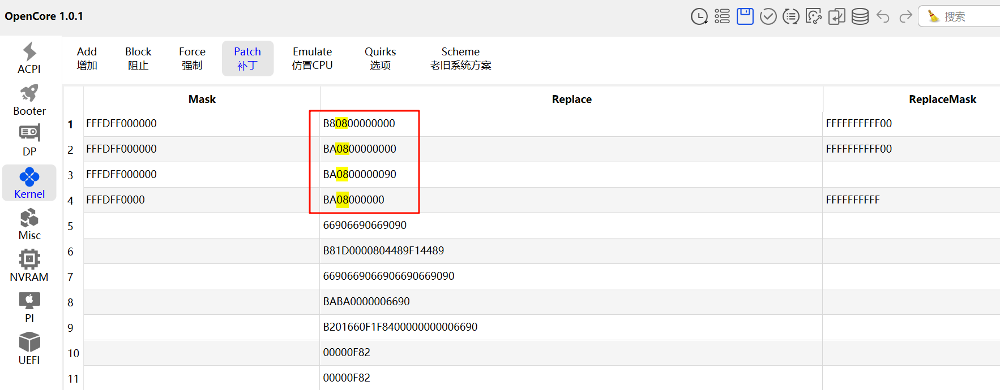

# GMKtec-M5

## System Info

CPU: AMD Ryzen 7 5700U

GPU: AMD Radeon Graphics 4 GB

Wired network card：8125BS

Wireless network card: AX210

System version: Somona 14.5 (23F79) [support 10.13~14.5]

# kexts

1. [Lilu](https://github.com/acidanthera/Lilu)

2. [VirtualSMC](https://github.com/acidanthera/VirtualSMC)

3. [AppleMCEReporterDisabler](https://dortania.github.io/OpenCore-Install-Guide/ktext.html#extras)

4. [NVMeFix](https://github.com/acidanthera/NVMeFix)

5. [RestrictEvents](https://github.com/acidanthera/RestrictEvents)

6. [WhateverGreen](https://github.com/acidanthera/WhateverGreen)

7. AMDRyzenCPUPowerManagement --> with SMCAMDProcessor

8. [AppleALC](https://github.com/acidanthera/AppleALC)

9. [SMCAMDProcessor](https://github.com/trulyspinach/SMCAMDProcessor)

10. [LucyRTL8125Ethernet](https://github.com/Mieze/LucyRTL8125Ethernet)

11. [NootedRed](https://github.com/ChefKissInc/NootedRed)

12. USBPorts --> created by [Hackintool](https://github.com/benbaker76/Hackintoo) --> before installation, you need use [USBToolBox](https://github.com/USBToolBox/kext)

13. [AirportItlwm](https://github.com/OpenIntelWireless/itlwm)

14. [RadeonSensor](https://github.com/ChefKissInc/RadeonSensor)

15. [IntelBluetoothFirmware](https://github.com/OpenIntelWireless/IntelBluetoothFirmware)

## 使用教程

下载 [Rufus](https://rufus.ie/zh) 并创建 USB 启动盘


利用 [OpenCorePkg](https://github.com/acidanthera/OpenCorePkg/releases) 里的 `/Utilities/macrecovery/macrecovery.py` 下载最新版基础镜像

```sh
python macrecovery.py -os latest download
```


将下载好的镜像和 EFI 一并放入启动盘中


开机按下 `ESC` 进入 BIOS, 选择 USB 启动, 按提示进行安装

安装之前最好更新 OC 并将非必要驱动关闭, 避免驱动的影响 ( 因为 BaseSystem.dmg 是最新的, EFI 未必及时更新 )


如果出现 `[EB|#LOG:EXITBS:START]` 可能还需要[更新补丁](https://dortania.github.io/OpenCore-Install-Guide/troubleshooting/extended/kernel-issues.html#kernel-patch-issues)

下载 [`patches.plist`](https://github.com/AMD-OSX/AMD_Vanilla) 并将里边的补丁复制到 `config.plist` 里, 并修改内核数



## 工具

| Tools                                                                         | Description                            |
| :---------------------------------------------------------------------------- | :------------------------------------- |
| [NootedRed](https://github.com/ChefKissInc/NootedRed)                         | The AMD Vega iGPU support patch kext   |
| [ryzen-hackintosh](https://github.com/mikigal/ryzen-hackintosh)               | OpenCore EFI for AMD Ryzen Hackintosh  |
| [OpenCore Legacy Patcher](https://dortania.github.io/OpenCore-Legacy-Patcher) | 让老款 Mac 电脑安装新的 MacOS          |
| [USBToolBox](https://github.com/USBToolBox/tool)                              | USB 端口定制映射工具                   |
| [gibMacOS](https://github.com/corpnewt/gibMacOS)                              | Py2/py3 script that can download macOS |
| [MountEFI](https://github.com/corpnewt/MountEFI)                              | 挂载 EFI 分区脚本                      |
| [SSDTTime](https://github.com/corpnewt/SSDTTime)                              | SSDT/DSDT hotpatch                     |
